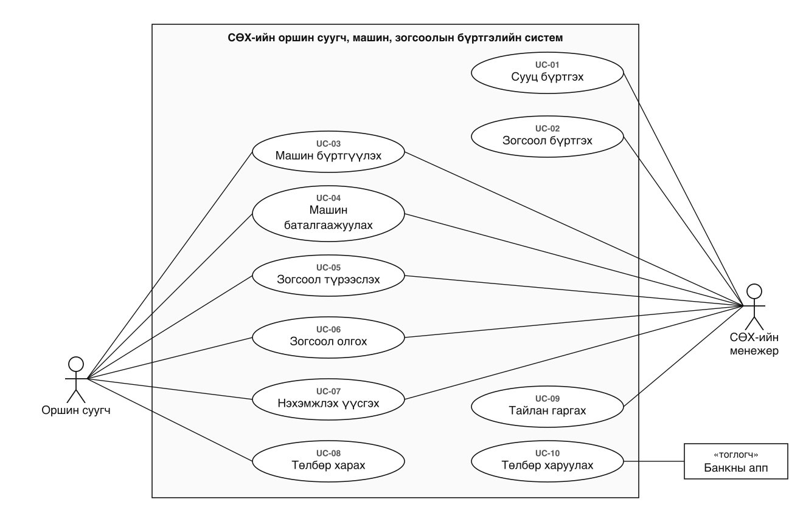
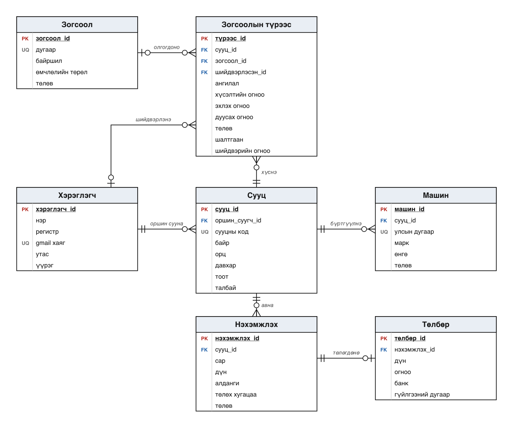

# Загвар — юзкейс ба ER диаграм

Энэ хуудсанд шаардлагын шинжилгээний үр дүнд гарсан загваруудыг нэгтгэв. Sprint-ийн story хэрэгжүүлэхдээ хүснэгт, талбарын нэрийг эндээс авч, ижил нэршил хэрэглэнэ.

Хэрэглэгч: **оршин суугч** (гар утас), **СӨХ-ийн менежер** (вэб). Гадаад систем: **банкны апп**.

## 1. Юзкейс диаграм

Арван юзкейс. Backlog-ийн User Story бүр аль нэг юзкейст харгалзана (`backlog.csv`-ийн «Юзкейс» багана).

## 2. Өгөгдлийн сангийн загвар

| Хүснэгт | Хадгалах мэдээлэл | Холбогдох story |
|---|---|---|
| Хэрэглэгч | Gmail хаяг, утас, үүрэг (оршин суугч, менежер) | US-01, US-02 |
| Сууц | Байр, орц, давхар, тоот, талбай, сууцны код, оршин суугч | US-02, US-14 |
| Зогсоол | Дугаар, байршил, өмчлөлийн төрөл (дундын, хувийн), төлөв | US-03 |
| Машин | Улсын дугаар, марк, өнгө, төлөв | US-04, US-05 |
| Зогсоолын түрээс | Хүсэлт, ангилал (нэг дэх, нэмэлт машин), хугацаа, шийдвэр гаргасан менежер ба огноо, шалтгаан | US-06 … US-11 |
| Нэхэмжлэх | Сарын дүн, алданги, төлөх хугацаа, төлөв | US-12, US-13, US-14 |
| Төлбөр | Төлсөн дүн, огноо, банк, гүйлгээний дугаар | US-13, US-14 |

Хоёр дүрмийг өгөгдлийн сангийн түвшинд хангана: сууцны код ба машины улсын дугаар давхардахгүй, нэг зогсоолд нэгэн зэрэг зөвхөн нэг идэвхтэй түрээс байна.

Хүлээлгийн жагсаалтад тусдаа хүснэгт байхгүй. Зогсоол оноогдоогүй, хүлээгдэж буй төлөвтэй хүсэлтийг эхлээд ангиллаар (нэг дэх машиных түрүүнд), дараа нь хүсэлтийн огноогоор эрэмбэлэхэд дараалал гарна.

## 3. Sprint 1-д хамаарах хэсэг

Sprint 1-ийн долоон story дараах хүснэгтэд тулгуурлана:

- Хүснэгт: Хэрэглэгч, Сууц, Зогсоол, Машин, Зогсоолын түрээс.

Нэхэмжлэх, Төлбөр хүснэгт Sprint 2-т орно.
