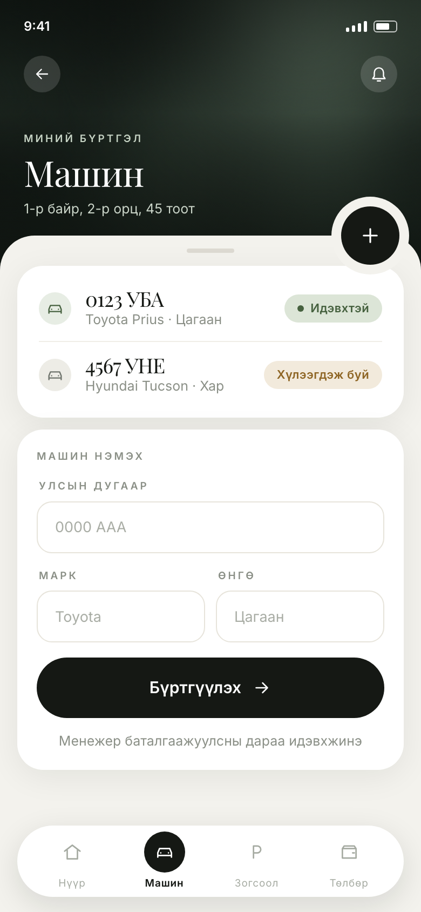
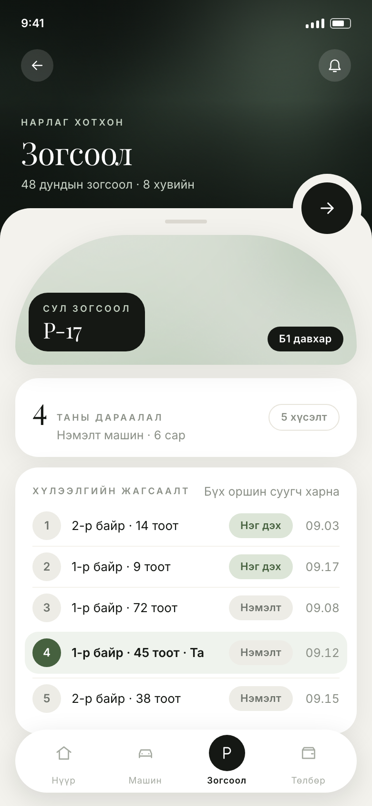
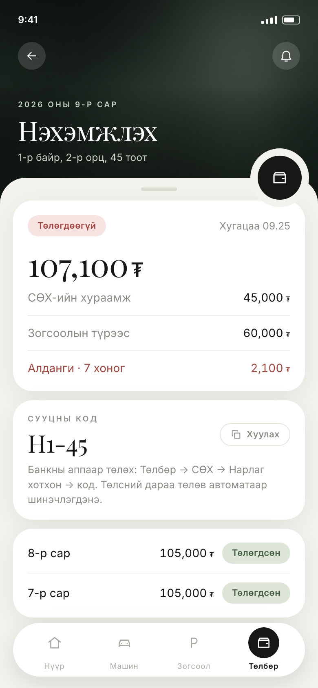
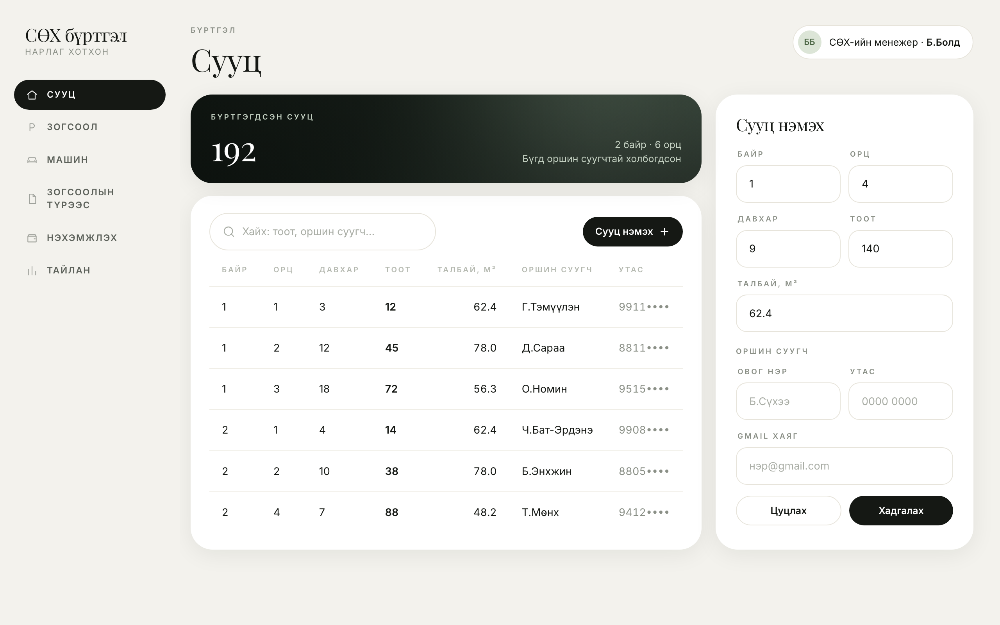
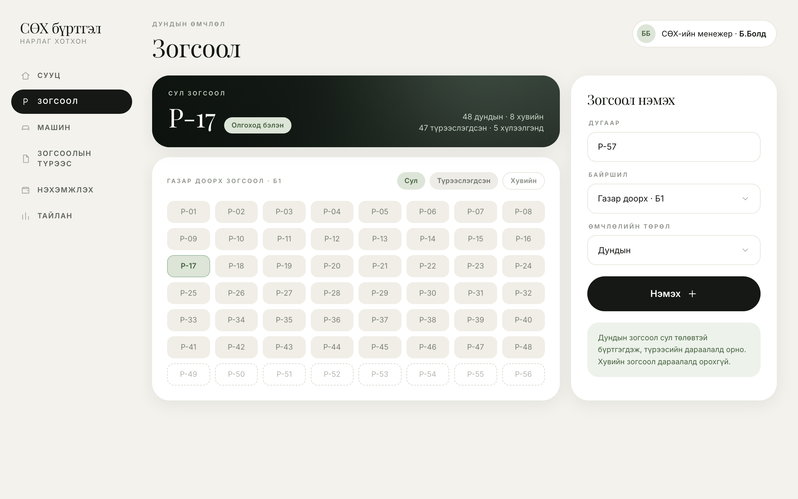
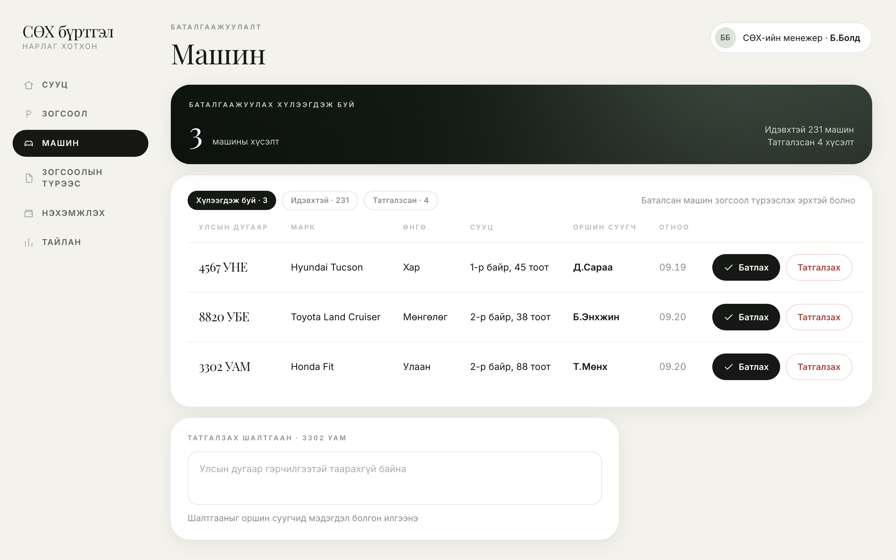
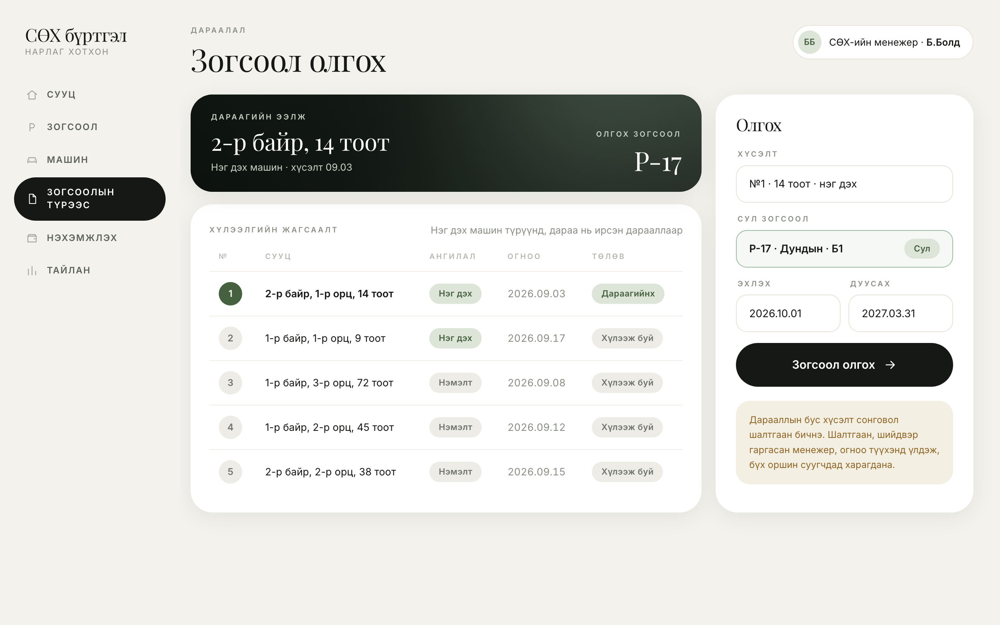
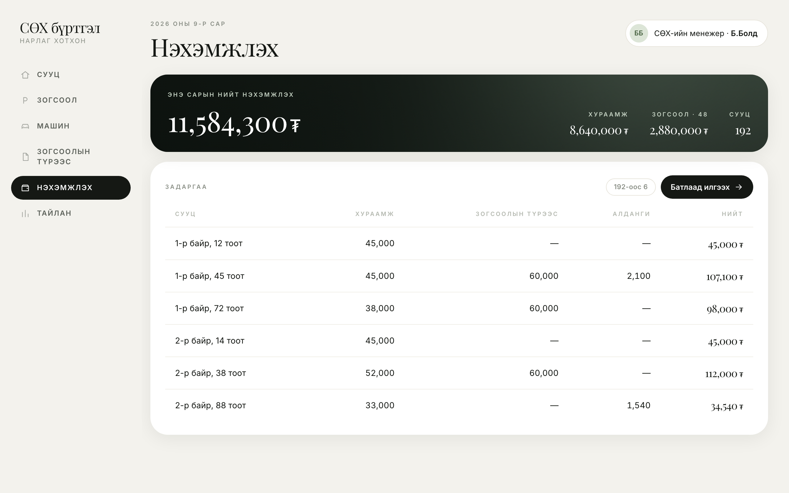
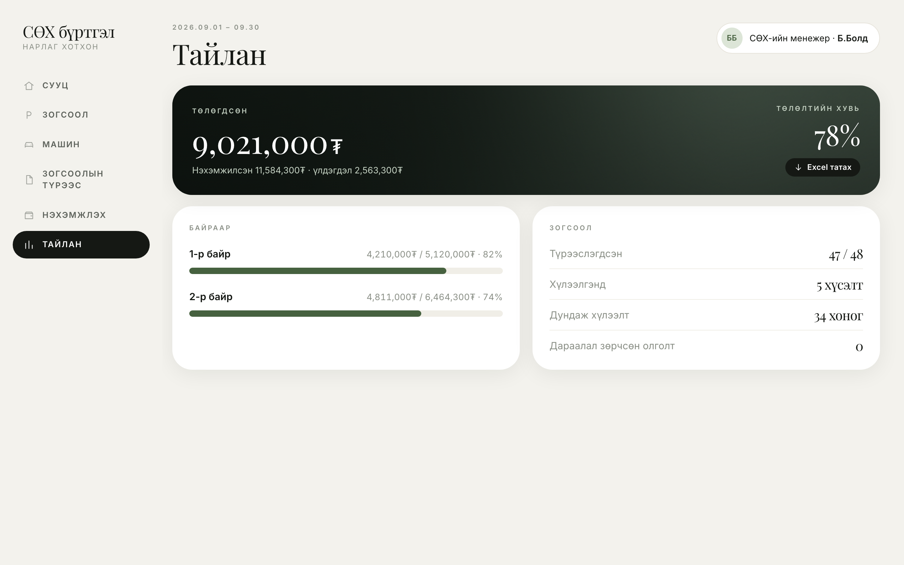

# Загвар — ER диаграм ба дэлгэцийн загвар

Энэ хуудсанд шаардлагын шинжилгээний үр дүнд гарсан загваруудыг нэгтгэв. Sprint-ийн story хэрэгжүүлэхдээ хүснэгт, талбарын нэрийг эндээс авч, ижил нэршил хэрэглэнэ.

Хэрэглэгч: **оршин суугч** (гар утас), **СӨХ-ийн менежер** (вэб). Гадаад систем: **банкны апп**.

## 1. Юзкейс диаграм

Арван юзкейс. Backlog-ийн User Story бүр аль нэг юзкейст харгалзана (`backlog.csv`-ийн «Юзкейс» багана).

## 2. Өгөгдлийн сангийн загвар

| Хүснэгт | Хадгалах мэдээлэл | Холбогдох story |
|---|---|---|
| Хэрэглэгч | Gmail хаяг, утас, үүрэг (оршин суугч, менежер) | US-01, US-02 |
| Сууц | Байр, орц, давхар, тоот, талбай, сууцны код, оршин суугч | US-02, US-14 |
| Зогсоол | Дугаар, байршил, өмчлөлийн төрөл (дундын, хувийн), төлөв | US-03 |
| Машин | Улсын дугаар, марк, өнгө, төлөв | US-04, US-05 |
| Зогсоолын түрээс | Хүсэлт, ангилал (нэг дэх, нэмэлт машин), хугацаа, шийдвэр гаргасан менежер ба огноо, шалтгаан | US-06 … US-11 |
| Нэхэмжлэх | Сарын дүн, алданги, төлөх хугацаа, төлөв | US-12, US-13, US-14 |
| Төлбөр | Төлсөн дүн, огноо, банк, гүйлгээний дугаар | US-13, US-14 |

Хоёр зүйлийг өгөгдлийн сангийн түвшинд хангана: сууцны код, машины улсын дугаар давхардахгүй, нэг зогсоолд нэгэн зэрэг зөвхөн нэг идэвхтэй түрээс байна.

Хүлээлгийн жагсаалтад тусдаа хүснэгт байхгүй. Зогсоол оноогдоогүй, хүлээгдэж буй төлөвтэй хүсэлтийг эхлээд ангиллаар (нэг дэх машиных түрүүнд), дараа нь хүсэлтийн огноогоор эрэмбэлэхэд дараалал гарна.

## 3. Дэлгэцийн загвар

### 3.1. Оршин суугчийн гар утасны апп

| Story | Дэлгэц |
|---|---|
| US-04 |  |
| US-06, US-07, US-08, US-09 |  |
| US-13 |  |

### 3.2. СӨХ-ийн менежерийн вэб

| Story | Дэлгэц |
|---|---|
| US-02 |  |
| US-03 |  |
| US-05 |  |
| US-09, US-10, US-11 |  |
| US-12 |  |
| US-15 |  |

Бүх дэлгэц нэг нөхцөл байдлыг харуулна: P-17 зогсоол чөлөөлөгдөж, хүлээлгийн жагсаалтад таван хүсэлт байгаа бөгөөд нэмэлт машины хүсэлт гаргасан Д.Сараа дөрөвт байна.

US-01 нэвтрэлтийн дэлгэцийг хараахан зураагүй. Sprint 1-д багтаж байгаа тул хэрэгжүүлэхийн өмнө зурна.

US-14 дэлгэцгүй. Систем банкны апптай шууд холбогдоно.

## 4. Sprint 1-д хамаарах хэсэг

Sprint 1-ийн долоон story дараах хүснэгт, дэлгэцэд тулгуурлана:

- Хүснэгт: Хэрэглэгч, Сууц, Зогсоол, Машин, Зогсоолын түрээс.
- Дэлгэц: Сууц бүртгэх, Зогсоол бүртгэх, Машин бүртгүүлэх, Машин баталгаажуулах, Зогсоол түрээслэх, нэвтрэх дэлгэц.

Нэхэмжлэх, Төлбөр хүснэгт болон тайлангийн дэлгэц Sprint 2-т орно.
