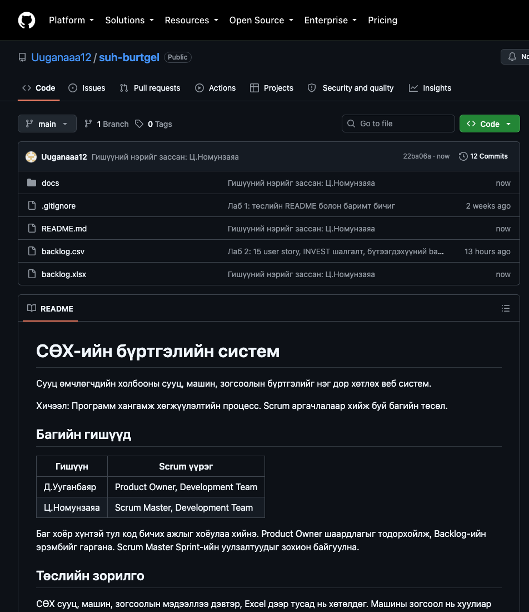
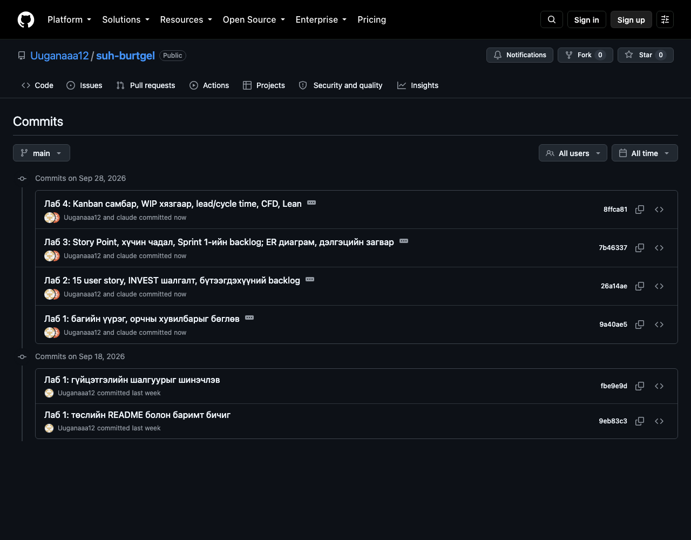

# Лабораторийн ажил №1 — Хөгжүүлэлтийн орчин байгуулах ба Git ашиглах

Хичээл: Программ хангамж хөгжүүлэлтийн процесс\
Төсөл: СӨХ-ийн сууц, машин, зогсоолын бүртгэлийн систем

## 1. Багийн бүрэлдэхүүн, Scrum үүрэг

| Гишүүн | Scrum үүрэг | Хариуцах ажил |
|---|---|---|
| Д.Ууганбаяр | Product Owner, Development Team | Шаардлага тодорхойлох, Backlog-ийн эрэмбэ тогтоох, story хүлээн авах, код бичих |
| Ц.Номунзаяа | Scrum Master, Development Team | Sprint-ийн уулзалт зохион байгуулах, саад арилгах, процессыг мөрдүүлэх, код бичих |

Баг хоёр хүнтэй тул Development Team-д хоёулаа багтана. Product Owner нэг, Scrum Master нэг хүн байх шаардлагыг хангав. Үүргээ хоёулаа хэлэлцэж баталгаажуулав.

## 2. Хөгжүүлэлтийн орчин

| Хэрэгсэл | Хувилбар | Төлөв |
|---|---|---|
| Visual Studio Code | 1.138.0 | суусан |
| Git | 2.50.1 | суусан |
| GitLens | 19.2.0 | суусан |
| Prettier — Code formatter | 11.0.0 | суусан |
| Python extension | 2026.14.0 | суусан |

Шалгасан команд:

```bash
git --version
# git version 2.50.1 (Apple Git-155)

code --version
# 1.138.0
```

## 3. GitHub бүртгэл ба repository

1. github.com дээр `Uuganaaa12` бүртгэлээр нэвтэрсэн.
2. **New repository** дарж `suh-burtgel` нэрээр үүсгэсэн.
3. Description: «СӨХ-ийн сууц, машин, зогсоолын бүртгэлийн систем».
4. **Public** сонгосон.
5. *Initialize this repository with a README* сонголтыг **сонгоогүй**. README-г команд мөрөөс үүсгэв.

Repository: <https://github.com/Uuganaaa12/suh-burtgel>

## 4. Clone, commit, push

```bash
# 1. Repository-г локал компьютер дээр хуулах
git clone https://github.com/Uuganaaa12/suh-burtgel.git
cd suh-burtgel

# 2. README.md файлыг үүсгэж, төслийн танилцуулгыг бичих

# 3. Өөрчлөлтийг stage хийх
git add README.md

# 4. Commit үүсгэх
git commit -m "Анхны README файлыг нэмэв"

# 5. GitHub руу илгээх
git push origin main
```

Хоёр хүн нэг repository дээр ажиллах тул ажил эхлэхийн өмнө бусдын өөрчлөлтийг татаж авна:

```bash
git pull origin main
```

## 5. Үр дүн

- Repository GitHub дээр үүссэн: `Uuganaaa12/suh-burtgel`.
- README.md файл repo-ийн нүүр хуудсанд харагдаж байна.
- **Commits** хэсэгт commit-ууд бүртгэгдсэн. Эхний commit: `9eb83c3` «Лаб 1: төслийн README болон баримт бичиг».
- `docs/` хавтсанд лабораторийн ажлын тайлангууд, `backlog.csv` файлд бүтээгдэхүүний backlog байна.

Repository-ийн нүүр хуудас, README харагдсан байдлаар:



Commits жагсаалт:



## 6. Дүгнэлт

Энэ ажлаар Scrum үүргээ хуваарилж, VS Code болон Git-ийн орчноо бэлтгэж, төслийн repository-г GitHub дээр үүсгэв. Лаб 2, Лаб 3-ын бүх баримт бичгийг мөн энэ repository дотор хөтөлнө.

## Гүйцэтгэлийн шалгуур

- [x] VS Code, Git суурилуулсан
- [x] VS Code-д GitLens, Prettier, программчлалын хэлний extension суулгасан
- [x] GitHub бүртгэл үүсгэсэн (`Uuganaaa12`)
- [x] GitHub дээр шинэ repository үүсгэсэн (`suh-burtgel`)
- [x] Repository-г локал компьютер дээр clone хийсэн
- [x] README.md файл үүсгэсэн
- [x] `git add`, `git commit`, `git push` командуудыг хэрэглэсэн
- [x] GitHub дээр файл, commit-ууд харагдаж байна
- [x] Багийн гишүүдийн Scrum үүргийг тодорхойлсон
