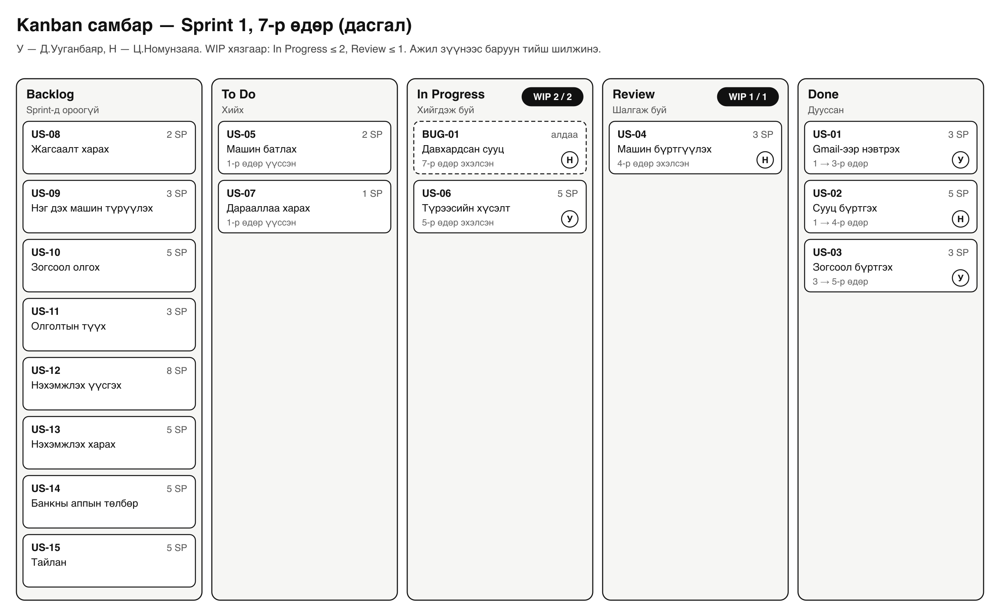
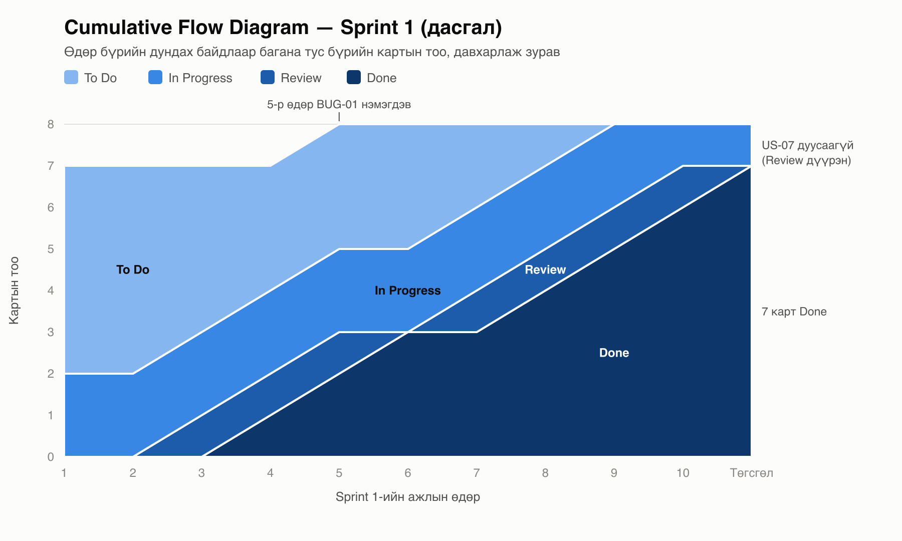

# Лабораторийн ажил №4 — Kanban самбар ба Lean зарчим

Хичээл: Программ хангамж хөгжүүлэлтийн процесс (4-р долоо хоног)\
Төсөл: СӨХ-ийн сууц, машин, зогсоолын бүртгэлийн систем

## 1. Зорилго

- Kanban-ийн үндсэн зарчмыг өөрийн төсөлд хэрэглэх.
- WIP хязгаар тогтоож, яагаад хэрэгтэйг тайлбарлах.
- Lead time, cycle time-ыг тооцоолж, ялгааг гаргах.
- Scrum ба Kanban-ыг харьцуулж, манай багт аль нь тохирохыг үнэлэх.

## 2. Kanban-ийн 4 зарчим манай багт

| Зарчим | Манай багт хэрхэн хэрэглэсэн |
|---|---|
| Одоогийн процессоос эхэл | Лаб 3-ын Sprint 1-ийн backlog, Scrum-ын үүргээ хэвээр үлдээж, дээр нь Kanban самбар нэмэв |
| Өөрчлөлтийг аажмаар хий | Эхлээд WIP хязгаар, баганын дүрмээ тогтоов. Sprint бүрийн төгсгөлд хэмжилтээ хараад нэг л зүйлийг өөрчилнө |
| Одоогийн үүрэг, хариуцлагыг хүндэтгэ | Product Owner, Scrum Master-ийн үүрэг өөрчлөгдөөгүй |
| Манлайллыг бүх түвшинд дэмж | Самбар дээр түгжрэл харсан хэн ч түүнийг тэмдэглэж, өдөр тутмын уулзалтад хэлнэ |

## 3. Kanban самбар

### 3.1. Багана, WIP хязгаар, шилжих нөхцөл

| Багана | Юу байх вэ | WIP хязгаар | Дараагийн баганад шилжих нөхцөл |
|---|---|---|---|
| Backlog | Sprint-д ороогүй story (US-08 … US-15) | — | Product Owner Sprint-д сонгосон |
| To Do | Sprint 1-ийн story (US-01 … US-07) | — | Нэг гишүүн картыг өөр дээрээ авсан |
| In Progress | Хийгдэж буй ажил | **2** | Код GitHub-д push хийгдэж, Pull Request нээгдсэн |
| Review | Нөгөө гишүүн шалгаж буй ажил | **1** | Шалгагч Pull Request-ийг merge хийж, story-ийн шалгуур биелсэн |
| Done | Дууссан ажил | — | — |

WIP хязгаарын үндэслэл:

- **In Progress = 2.** Баг хоёр хүнтэй. Хүн бүр нэг л картыг зэрэг хийнэ. Нэг хүн хоёр ажлыг ээлжлэн хийвэл ажил солих бүрт цаг алдана.
- **Review = 1.** Review-д карт хүлээж байвал шинэ ажил эхлэхээс өмнө эхлээд түүнийг шалгана. Зорилго нь олон ажлыг зэрэг эхлүүлэх биш, эхэлснээ дуусгах.

Карт бүрт ID, нэр, Story Point, хариуцагч, үүссэн, эхэлсэн, дууссан өдрийг бичнэ. Сүүлийн гурван өдрөөр Lead time, Cycle time-ыг бодно.

### 3.2. Самбарын зураг

Sprint 1-ийн 7 дахь өдрийн төлөв (4-р хэсгийн дасгалын өгөгдлөөр):

In Progress баганад 2, Review баганад 1 карт байгаа тул хоёулаа хязгаартаа хүрсэн. Энэ үед хэн ч To Do-оос шинэ карт авахгүй.

### 3.3. GitHub Projects дээр үүсгэх алхам

1. `suh-burtgel` repository → **Projects** → **New project** → **Board** загвар.
2. **Status** талбарын утгыг Backlog, To Do, In Progress, Review, Done болгож засна.
3. In Progress баганын цэсээс **Set limit** → 2, Review баганад → 1.
4. Нэмэлт талбар үүсгэнэ: **SP** (Number), **Эхэлсэн** (Date), **Дууссан** (Date).
5. `backlog.csv`-ийн 15 story-г карт болгон нэмж, US-01 … US-07-г To Do, бусдыг Backlog баганад байрлуулна.
6. Хоёр гишүүн хоёулаа project-д **Write** эрхтэй байна.

## 4. Lead time ба cycle time дасгал

> **Анхаар:** Sprint 1 хараахан эхлээгүй. Доорх өдрүүд нь Sprint 1-ийн төлөвлөгөөнд тулгуурласан **дасгалын өгөгдөл**, бодит хэмжилт биш. Sprint эхэлмэгц `backlog.xlsx`-ийн «Kanban (Sprint 1)» хуудсанд бодит огноог бичихэд Lead time, Cycle time автоматаар бодогдоно.

Тодорхойлолт (өдрийг Sprint-ийн ажлын өдрөөр тоолно):

- **Lead time** = дууссан өдөр − үүссэн өдөр + 1. Карт самбарт үүссэнээс дуусах хүртэлх бүх хугацаа.
- **Cycle time** = дууссан өдөр − эхэлсэн өдөр + 1. Ажил бодитоор эхэлснээс дуусах хүртэлх хугацаа.
- **Хүлээлт** = эхэлсэн өдөр − үүссэн өдөр.
- Lead time = хүлээлт + cycle time.

Sprint 1-ийн 7 story Sprint-ийн 1-р өдөр самбарт орсон. 5-р өдөр US-04 дээр ажиллах явцад ижил тоот хоёр удаа бүртгэгдэж байгааг илрүүлээд **BUG-01** карт нэмэв. Kanban-д шинэ ажлыг аль ч үед нэмдэг.

| Карт | SP | Хариуцагч | Үүссэн | Эхэлсэн | Дууссан | Хүлээлт | Cycle time | Lead time |
|---|---|---|---|---|---|---|---|---|
| US-01 Gmail-ээр нэвтрэх | 3 | Ууганбаяр | 1 | 1 | 3 | 0 | 3 | 3 |
| US-02 Сууц бүртгэх | 5 | Номинзаяа | 1 | 1 | 4 | 0 | 4 | 4 |
| US-03 Зогсоол бүртгэх | 3 | Ууганбаяр | 1 | 3 | 5 | 2 | 3 | 5 |
| US-04 Машин бүртгүүлэх | 3 | Номинзаяа | 1 | 4 | 7 | 3 | 4 | 7 |
| BUG-01 Давхардсан сууц | — | Номинзаяа | 5 | 7 | 8 | 2 | 2 | 4 |
| US-06 Түрээсийн хүсэлт | 5 | Ууганбаяр | 1 | 5 | 9 | 4 | 5 | 9 |
| US-05 Машин батлах | 2 | Номинзаяа | 1 | 8 | 10 | 7 | 3 | 10 |
| US-07 Дарааллаа харах | 1 | Ууганбаяр | 1 | 9 | — | 8 | — | — |
| **Дууссан 7 картын дундаж** | | | | | | **2.6** | **3.4** | **6.0** |

Үр дүн:

- **Дундаж cycle time 3.4 өдөр, дундаж lead time 6.0 өдөр.** Нэг ажил 3–4 өдөрт хийгддэг ч захиалагч үр дүнгээ дунджаар 6 өдөрт авна.
- **Урсгалын үр ашиг** = нийт cycle time / нийт lead time = 24 / 42 ≈ **57%**. Үлдсэн 43% нь хүлээлт.
- **Throughput** = 10 өдөрт 7 карт = өдөрт 0.7, долоо хоногт 3.5 карт.
- **Velocity** = дууссан story-н SP = 21. Төлөвлөсөн 22 SP-ээс US-07 (1 SP) Sprint 2-т шилжинэ.

Throughput ба velocity хоёулаа багийн хүчин чадлыг харуулна. Velocity story point-оор, throughput картын тоогоор хэмждэг. BUG-01 story point-гүй тул velocity-д орохгүй ч throughput-д орно.

### 4.1. Cumulative Flow Diagram

CFD-ээс харагдах зүйлс:

1. **To Do давхарга эхэндээ өргөн.** 7 картыг бүгдийг нь 1-р өдөр самбарт оруулсан тул сүүлд эхэлсэн картууд удаан хүлээсэн. US-05 10 өдрийн 7-г нь хүлээж өнгөрүүлэв.
2. **Review давхарга 3-р өдрөөс хойш бараг тасралтгүй 1 карттай.** US-07-ийн хөгжүүлэлт 9-р өдөр дууссан ч 10-р өдөр Review дүүрэн байсан тул орсонгүй, Sprint-ийн төгсгөлд дуусаагүй үлдэв.
3. **Дээд хил 5-р өдөр 7-оос 8 болж өссөн** нь BUG-01 нэмэгдсэнийг харуулна.

Дараагийн Sprint-д хийх өөрчлөлт (нэг л өөрчлөлт, 2-р зарчмын дагуу): **«Өглөө бүр эхлээд review, дараа нь шинэ ажил»** гэсэн дүрэм нэмнэ. Review-ийн түгжрэл арилахгүй бол WIP хязгаарыг 2 болгоно.

## 5. Lean: 7 үрэлгэн зардал манай төсөлд

**Value** — оршин суугч, СӨХ-ийн менежерт хэрэгтэй зүйл: зогсоолыг ил тод дарааллаар авах, бүртгэлээ нэг дор хөтлөх. **Value stream** — нэг story-г backlog-оос Done хүртэл хүргэх алхмууд: Backlog → To Do → In Progress → Review → Done. Дасгалд эдгээр алхмын 43% нь хүлээлт байв.

| № | Үрэлгэн зардал | Манай төсөлд | Арга хэмжээ |
|---|---|---|---|
| 1 | Илүүдэл үйлдвэрлэл | Эхний хувилбарт QPay-ээр төлбөр авах хэсэг хийхээр төлөвлөсөн байв. Оршин суугч банкны аппаараа төлдөг тул энэ нь хэрэггүй ажил болж, story-г хасав | Хэрэглэгчид үнэ цэнэ өгөхгүй story-г backlog-оос хасна |
| 2 | Хүлээлт | Review хүлээсэн карт (дасгалд US-07), Product Owner-ын шийдвэр хүлээх | Өглөө бүр эхлээд review хийнэ. PO асуултад тухайн өдөрт нь хариулна |
| 3 | Илүү боловсруулалт | Story хэрэгжихээс өмнө дэлгэцийн загварыг олон удаа өнгөлөх | Эхлээд гар зургийн түвшинд тохиролцож, өнгөлгөөг хэрэгжүүлэх үед хийнэ |
| 4 | Согог | Дасгал дахь BUG-01: давхардсан сууц бүртгэгдэв | Давхардал шалгах тестийг «Done»-ы нөхцөлд нэмнэ |
| 5 | Хөдөлгөөн | Нэг хүн хоёр картыг ээлжлэн хийж, ажил солих бүрт цаг алдах | Хүн бүр нэг л In Progress карттай (WIP 2) |
| 6 | Тээвэрлэлт (мэдээлэл дамжуулах) | Шаардлага дипломын баримт ба энэ backlog хоёр газар байгаа тул нэг өөрчлөлтийг хоёр газар хийдэг | Story бүрийг юзкейсийн дугаараар холбож, өөрчлөлтийг нэг эх сурвалжаас шинэчилнэ |
| 7 | Нөөц (хагас хийсэн ажил) | Sprint эхэнд 7 картыг бүгдийг самбарт оруулснаар хүлээх хугацаа өссөн | Хагас хийсэн ажлыг цөөн байлгаж, эхэлснээ дуусгана |

## 6. Scrum ба Kanban — манай багт аль нь тохирох вэ

| Шинж | Scrum | Kanban | Манай баг |
|---|---|---|---|
| Хугацаа | Тогтмол урттай Sprint | Тасралтгүй урсгал | 2 долоо хоногийн Sprint хэвээр |
| Үүрэг | PO, SM, Dev | Одоогийн үүргээ хадгална | PO, SM үүрэг хэвээр |
| Өөрчлөлт | Sprint дундаа хориотой | Аль ч үед шинэ ажил нэмнэ | Шинэ story Sprint дундуур орохгүй. Зөвхөн алдаа (BUG) шууд орно |
| Хэмжүүр | Velocity | Cycle time, throughput | Хоёуланг нь: velocity 21 SP, cycle time 3.4 өдөр |

Манай төсөл тодорхой зорилготой шинэ бүтээгдэхүүн тул Scrum-ын Sprint, Sprint зорилгыг хадгална. Sprint дотор Kanban самбар, WIP хязгаар, cycle time хэмжилтийг хэрэглэнэ. Энэ хосолсон хандлагыг **Scrumban** гэдэг. Систем ашиглалтад орсны дараа засвар, хүсэлт тасралтгүй ирэх тул тэр үед Kanban руу шилжинэ.

## 7. Дүгнэлт

Энэ ажлаар Sprint 1-ийн backlog дээр таван баганатай Kanban самбар зохион байгуулж, In Progress-д 2, Review-д 1 гэсэн WIP хязгаар тогтоов. Дасгалын өгөгдлөөр дундаж cycle time 3.4 өдөр, lead time 6.0 өдөр, урсгалын үр ашиг 57% гарав. CFD-ээс review-ийн түгжрэл, Sprint эхэнд хэт олон карт оруулсны нөлөөг илрүүлэв. Lean-ийн 7 үрэлгэн зардлыг өөрийн процесстоо тулгаж, арга хэмжээ тодорхойлов. Манай багт Scrumban тохирно.

## Биелэлтийн шалгуур

- [x] Kanban-ийн 4 зарчмыг төсөлдөө хэрэглэж тайлбарласан
- [x] Kanban самбарын багана, шилжих нөхцөл, WIP хязгаарыг тогтоосон
- [x] Lead time, cycle time-ыг тооцоолж, ялгааг гаргасан
- [x] CFD зурж, саад тотгорыг илрүүлсэн
- [x] Lean-ийн 7 үрэлгэн зардлыг өөрийн процесстоо хэрэглэсэн
- [x] Scrum ба Kanban-ыг харьцуулж, манай багт тохирохыг үнэлсэн
